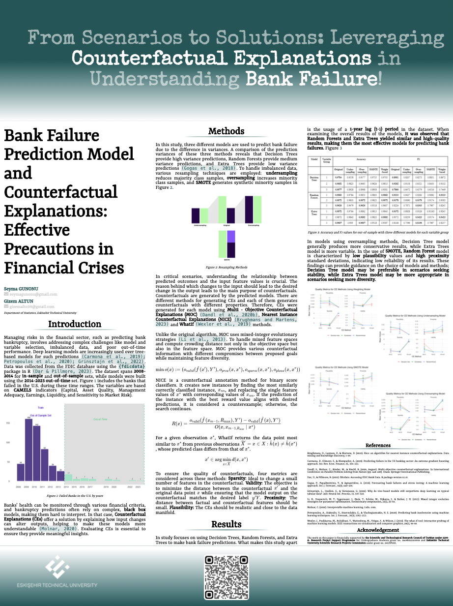

# Counterfactual Explanations of Bank Failure Prediction Models

This repository contains code and resources related to the implementation of counterfactual explanations for bank failure prediction models.

## Table of Contents

1. [Overview](#overview)
2. [Contents](#contents)
3. [Getting Started](#getting-started)
4. [References](#references)
5. [Acknowledgement](#acknowledgement)

## Overview 

Bank failure prediction is a crucial task in financial risk management. Predictive models are developed to assess the likelihood of a bank failing based on various features and historical data. However, understanding the reasons behind model predictions is equally important for stakeholders such as regulators, investors, and bank management.

Counterfactual explanations provide insight into why a particular prediction was made by identifying the minimal changes required to alter the prediction outcome. In the context of bank failure prediction, these explanations can help stakeholders understand the factors contributing to the model's decisions and take appropriate actions to mitigate risks.

## Contents 

- `data/`: This directory contains datasets used for training and evaluation.
- `model/`: Implementation of bank failure prediction models.
- `counterfactual_for_all_models/`: Codes for generating counterfactual explanations.
- `poster/`: Codes for PDF poster.

## Getting Started  

1. Clone this repository to your local machine.
2. Download the packages in the [libraries](https://github.com/seymagnn/UYIK2024_Counterfactual_Explanations_of_Bank_Failure_Prediction_Models/blob/main/libraries.R) script.
3. Complete data manipulation operations by pulling metrics from the [arranged data](https://github.com/seymagnn/UYIK2024_Counterfactual_Explanations_of_Bank_Failure_Prediction_Models/blob/main/data/arranging_data.R) script.
4. Splitting data into two subsets in [model partition](https://github.com/seymagnn/UYIK2024_Counterfactual_Explanations_of_Bank_Failure_Prediction_Models/blob/main/model/model_partition.R) script.
5. Each model is included in 3 separate methods for the original dataset, 3 resampling and weighting methods. You can get all the counterfactuals in [Original](https://github.com/seymagnn/Counterfactual_Explanations_of_Bank_Failure_Prediction_Models/tree/main/counterfactuals_for_all_models/original), [Oversampling](https://github.com/seymagnn/Counterfactual_Explanations_of_Bank_Failure_Prediction_Models/tree/main/counterfactuals_for_all_models/oversampling), [Undersampling](https://github.com/seymagnn/Counterfactual_Explanations_of_Bank_Failure_Prediction_Models/tree/main/counterfactuals_for_all_models/undersampling), [SMOTE](https://github.com/seymagnn/Counterfactual_Explanations_of_Bank_Failure_Prediction_Models/tree/main/counterfactuals_for_all_models/smote) and [Weighting](https://github.com/seymagnn/Counterfactual_Explanations_of_Bank_Failure_Prediction_Models/tree/main/counterfactuals_for_all_models/weighting) scripts.

## References  

Brughmans, D., Leyman, P., & Martens, D. (2023). Nice: an algorithm for nearest instance counterfactual explanations. Data mining and knowledge discovery, 1-39.

Carmona, P., Climent, F., & Momparler, A. (2019). Predicting failure in the US banking sector: An extreme gradient boosting approach. Int. Rev. Econ. Finance, 61, 304-323.

Dandl, S., Molnar, C., Binder, M., & Bischl, B. (2020, August). Multi-objective counterfactual explanations. In International Conference on Parallel Problem Solving from Nature (pp. 448-469). Cham: Springer International Publishing.

Dar, U., & Pillmore, B. (2023). fdicdata: Accessing FDIC Bank Data. R package version 0.1.0.

Gogas, P., Papadimitriou, T., & Agrapetidou, A. (2018). Forecasting bank failures and stress testing: A machine learning approach. Int. J. Forecast., 34(3), 440-455.

Grinsztajn, L., Oyallon, E., & Varoquaux, G. (2022). Why do tree-based models still outperform deep learning on typical tabular data?. Adv. Neural Inf. Process, 35, 507-520.

Li, R., Emmerich, M. T., Eggermont, J., Bäck, T., Schütz, M., Dijkstra, J., & Reiber, J. H. (2013). Mixed integer evolution strategies for parameter optimization. Evolutionary computation, 21(1), 29-64.

Molnar, C. (2020). Interpretable machine learning. Lulu. com.

Petropoulos, A., Siakoulis, V., Stavroulakis, E., & Vlachogiannakis, N. E. (2020). Predicting bank insolvencies using machine learning techniques. Int. J. Forecast., 36(3), 1092-1113.

Wexler, J., Pushkarna, M., Bolukbasi, T., Wattenberg, M., Viégas, F., & Wilson, J. (2019). The what-if tool: Interactive probing of machine learning models. IEEE transactions on visualization and computer graphics, 26(1), 56-65.

## Acknowledgement  

The work on this paper is financially supported by **the Scientific and Technological Research Council of Turkiye under 2209-A- Research Project Support Programme** for Undergraduate Students grant no. 1649B022303919 and **Eskisehir Technical University Scientific Research Projects Commission** under grant no. 24LÖP006.
