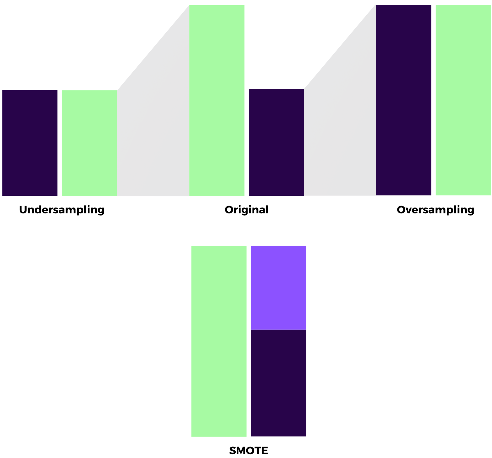
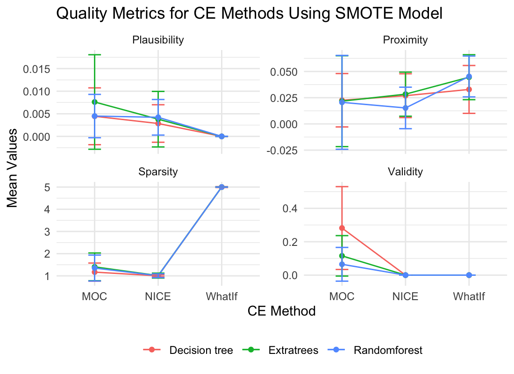
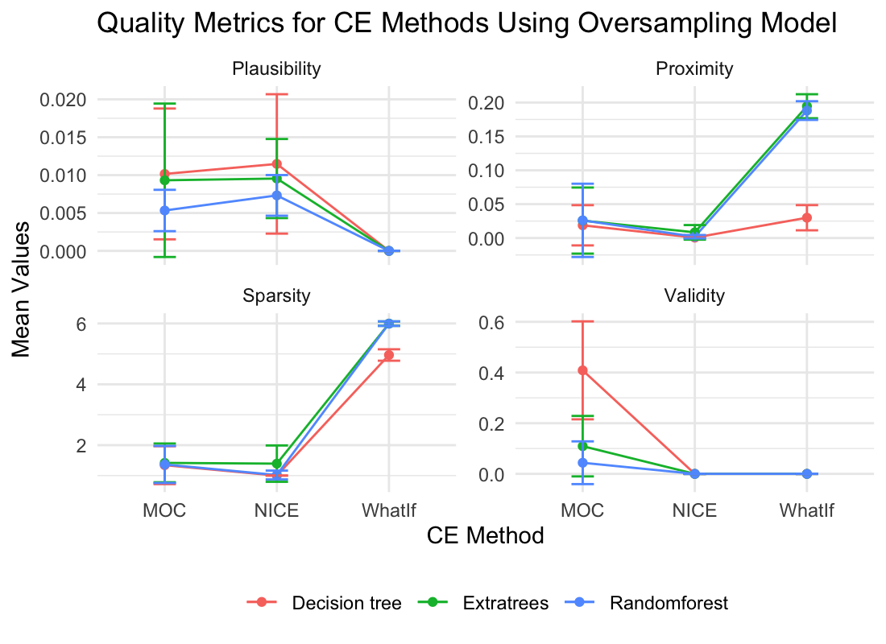

```{=html}
<style>
#title {
  font-size: 110pt;
}

#main-img-left {
  width: 20%;
  left: 1in;
  bottom: 1.0in;
}

.main {
  background-color: #0b5657;
  background-image: linear-gradient(#0b5657 50%, #FFFFFF);
}

.main_bottom {
  background-color: #0b5657;
  background-image: linear-gradient(#FFFFFF 5%, #0b5657);
}

#author {
 font-size: 0.9em;
}


#main-img-right {
  width: 17%;
  right: 1in;
  bottom: 1.2in;
}

#introduction {
  font-size: 40px;
  line-height: 0.9;
}

#methods {
  font-size: 40px;
  line-height: 0.9;
}

#results {
  font-size: 40px;
  line-height: 0.9;
}

#references {
  font-size: 22px;
  line-height: 0.9;
}

#acknowledgement {
  font-size: 22px;
  line-height: 0.9;
}

</style>
```

```{r, include=FALSE}
knitr::opts_chunk$set(echo = FALSE,
                      warning = FALSE,
                      tidy = FALSE,
                      message = FALSE,
                      fig.align = 'center',
                      out.width = "100%")
options(knitr.table.format = "html") 
```

# Introduction

Managing risks in the financial sector, such as predicting bank bankruptcy, involves addressing complex challenges like model and variable selection, imbalanced data, and poor out-of-time performance.
Deep learning models are increasingly used over tree-based models for such predictions `(Carmona et al., 2019); Petropoulos et al., 2020); Grinsztajn et al., 2022)`.
Data was collected from the FDIC database using the **`{fdicdata}`** package in R `(Dar & Pillmore, 2023)`.
The dataset spans **2008-2014** for **in-sample** and **out-of-sample** sets, while models were built using the **2014-2023** **out-of-time** set. Figure \@ref(fig:figures) includes the banks that failed in the U.S. during these time ranges. The variables are based on **CAMELS** indicators (Capital, Asset Quality, Management Adequacy, Earnings, Liquidity, and Sensitivity to Market Risk). 

```{r figures, fig.cap='Failed Banks in the U.S. by years'}
knitr::include_graphics("failed_banks_by_years.png")
```

Banks' health can be monitored through various financial criteria, and bankruptcy predictions often rely on complex, **black box** models, making them hard to interpret.
In that case, **Counterfactual Explanations (CEs)** offer a solution by explaining how input changes can alter outputs, helping to make these models more understandable `(Molnar, 2020)`.
Evaluating CEs is essential to ensure they provide meaningful insights.

```{r, include=FALSE}
knitr::write_bib(c('posterdown', 'rmarkdown','pagedown'), 'packages.bib')
```

# Methods

In this study, three different models are used to predict bank failure due to the difference in variances.
A comparison of the prediction variances of these three methods reveals that Decision Trees provide high variance predictions, Random Forests provide medium variance predictions, and Extra Trees provide low variance predictions `(Gogas et al., 2018)`.
To handle imbalanced data, various resampling techniques are employed: **undersampling** reduces majority class samples, **oversampling** increases minority class samples, and **SMOTE** generates synthetic minority samples in Figure \@ref(fig:resamplingmethods).


```{r resamplingmethods, out.width="50%", fig.cap='Resampling Methods'}

```

In critical scenarios, understanding the relationship between predicted outcomes and the input feature values is crucial. The reason behind which changes to the input should lead to the desired change in the output leads to the main purpose of counterfactuals. Counterfactuals are generated by the predicted models. There are different methods for generating CEs and each of them generates counterfactuals with different properties. Therefore, CEs were generated for each model using **Multi - Objective Counterfactual Explanations (MOC)** `(Dandl et al., 2020b)`, **Nearest Instance Counterfactual Explanations (NICE)** `(Brughmans and Martens, 2023)` and **WhatIf** `(Wexler et al., 2019)` methods.

Unlike the original algorithm, MOC uses mixed-integer evolutionary strategies `(Li et al., 2013)`. To handle mixed feature spaces and compute crowding distance not only in the objective space but also in the feature space. MOC provides various counterfactual information with different compromises between proposed goals while maintaining feature diversity.

```{=tex}
\begin{equation}
\min{o(x)} := (o_{valid}(\hat{f}(x'), Y'), o_{prox}(x,x^*), o_{sparse}(x,x^*), o_{plaus}(x,x^*))
\end{equation}
```

NICE is a counterfactual annotation method for binary score classifiers. It creates new instances by finding the most similarly correctly classified instance, $x_{nn}$, and replacing the single feature values of $x^*$ with corresponding values of $x_{nn}$. If the prediction of the instance with the best reward value aligns with desired predictions, it is considered a counterexample; otherwise, the search continues.

```{=tex}
\begin{equation}
R(x) = \frac{o_{\text{valid}}(\hat{f}(x_{m-1}, R_{\max}), Y') - o_{\text{valid}}(\hat{f}(x), Y')}{O(x, x_{m-1,R_{\max}} \mid x^*)}
\end{equation}
```

For a given observation $x^*$, WhatIf returns the data point most similar to $x^*$ from previous observations $\widetilde{X} = {x \in X : \hat{h}(x) \neq \hat{h}(x^*)}$, whose predicted class differs from that of $x^*$.

```{=tex}
\begin{equation}
x' \in \text{arg} \min_{x \in \widetilde{X}}  d(x,x^*)
\end{equation}
```

To ensure the quality of counterfactuals, four metrics are considered across these methods:
**Sparsity:** Ideal to change a small number of features in the counterfactual.
**Validity:** The objective is to minimize the distance between the counterfactual $x'$ and the original data point $x$ while ensuring that the model output on the counterfactual matches the desired label $y'Y$.
**Proximity:** The distance between factual and counterfactual features should be small.
**Plausibility:** The CEs should be realistic and close to the data manifold.


# Results

In study focuses on using Decision Trees, Random Forests, and Extra Trees to make bank failure predictions. What makes this study apart is the usage of a **1-year lag (t-1) period** in the dataset. When examining the overall results of the models, **it was observed that Random Forests and Extra Trees yielded similar and high-quality results, making them the most effective models for predicting bank failures.** Figure \@ref(fig:modelresults)

```{r modelresults, fig.cap='Accuracy and F1 values for out-of-sample with three different models for each variable group'}
knitr::include_graphics("out_of_sample_results.png")
```

In models using oversampling methods, Decision Tree model generally produces more conservative results, while Extra Trees model is more variable. In the use of **SMOTE, Random Forest** model is characterized by **low plausibility** values and **high proximity** standard deviations, indicating low reliability of its results. These findings can provide guidance on the choice of models and methods; **Decision Tree model may be preferable in scenarios seeking stability, while Extra Trees model may be more appropriate in scenarios seeking more diversity.**


```{=html}
<div>
    <div style="float: left; width: 50%;">
        
    </div>
    <div style="float: right; width: 50%;">
        
    </div>
    <div style="float: left; width: 50%;">
        
    </div>
    <div style="float: right; width: 50%;">
        
    </div>
</div>

```


# References

Brughmans, D., Leyman, P., & Martens, D. (2023). Nice: an algorithm for nearest instance counterfactual explanations. Data mining and knowledge discovery, 1-39.

Carmona, P., Climent, F., & Momparler, A. (2019). Predicting failure in the US banking sector: An extreme gradient boosting approach. Int. Rev. Econ. Finance, 61, 304-323.

Dandl, S., Molnar, C., Binder, M., & Bischl, B. (2020, August). Multi-objective counterfactual explanations. In International Conference on Parallel Problem Solving from Nature (pp. 448-469). Cham: Springer International Publishing.

Dar, U., & Pillmore, B. (2023). fdicdata: Accessing FDIC Bank Data. R package version 0.1.0.

Gogas, P., Papadimitriou, T., & Agrapetidou, A. (2018). Forecasting bank failures and stress testing: A machine learning approach. Int. J. Forecast., 34(3), 440-455.

Grinsztajn, L., Oyallon, E., & Varoquaux, G. (2022). Why do tree-based models still outperform deep learning on typical tabular data?. Adv. Neural Inf. Process, 35, 507-520.

Li, R., Emmerich, M. T., Eggermont, J., Bäck, T., Schütz, M., Dijkstra, J., & Reiber, J. H. (2013). Mixed integer evolution strategies for parameter optimization. Evolutionary computation, 21(1), 29-64.

Molnar, C. (2020). Interpretable machine learning. Lulu. com.

Petropoulos, A., Siakoulis, V., Stavroulakis, E., & Vlachogiannakis, N. E. (2020). Predicting bank insolvencies using machine learning techniques. Int. J. Forecast., 36(3), 1092-1113.

Wexler, J., Pushkarna, M., Bolukbasi, T., Wattenberg, M., Viégas, F., & Wilson, J. (2019). The what-if tool: Interactive probing of machine learning models. IEEE transactions on visualization and computer graphics, 26(1), 56-65.


# Acknowledgement

The work on this paper is financially supported by **the Scientific and Technological Research Council of Turkiye under 2209-A- Research Project Support Programme** for Undergraduate Students grant no. 1649B022303919 and **Eskisehir Technical University Scientific Research Projects Commission** under grant no. 24LÖP006.
